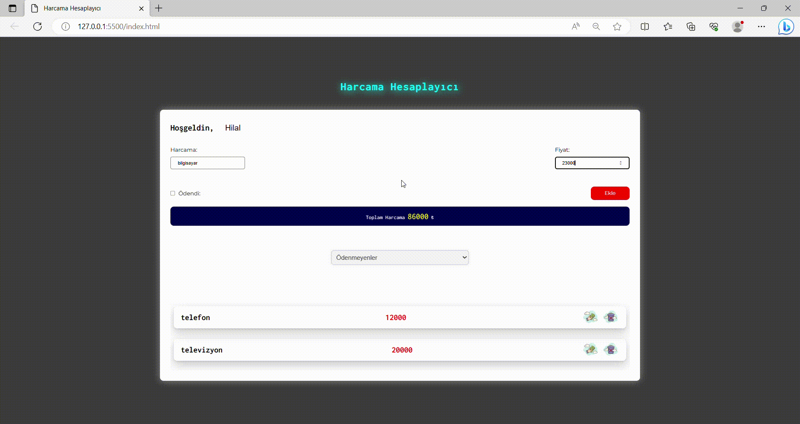

# <h1>Harcama Hesaplayıcı</h1>

Gider hesapları için olusturulan javascript app

## 'Deploy'

https://thriving-fairy-9093bc.netlify.app

### 'screen'

# yapılacaklar 

-ekle butonuna tıklanıldıgında ınputların ıcerısıne yazılanlara
erıs ve alert ile ekrana yaz 
--inputlardan bırı dahı bos ıse ekrana uyarı olarak alert bas 
--iki inputta dolu ise ekrana bir tane harcama  kartı bas
--eger checkbox tiklenirse `payed` classı ekle
--form gonderılınce ınputları temızle

-Bir toplam alanı ve js de toplam degıskenı olustur 
--js tarafından eklenen butun harcamaların fıyatlarını bu degıskene
ekle
--degişken her guncellendıgınde ekranı da guncelle(fonk. yazılabılır)

-silme butonuna basılma olayını izle
--butona tıklandıgında kapsayıcısını html den kaldır
-kaldırılan harcamanın fıyatını toplamdan cıkar

-kullanıcı ısmını al 
--ve ismi localstorage kaydet
--kullanıcı uygulamaya girdiginde localstorage da ısmı 
kaydedılmısse onu al ve ınputa aktar

-filtreleme alanında ne secılırse onun degerını al
--o degere gore hangı harcamaların ekrana basılacagına karar ver

# notlar

-hoisting
-önemli olan degerleri (fonksiyon ve degiskenler) ilk önce tanımlar
-Bu sayede fonksiyonları once kullanıp sonra tanımlayabılıyoruz

-!
-degiskenın degerlerının undefined null NAN {} "" bütün bos olma
durumlarını kontrol eder

-return
--fonksiyonu durdurmaya yarar
--fonksiyonun cagrıldıgı yere veri gönderme

-break
--switch case yapısında caselerden sonra ve dongulerde kullanılır

- == yalnızca deger kontrolu yaparken (3== "3" > true)
- === hem tur hem deger kontrolu yapar (3 === "3" > false)

-js tarafından eklenen bır html elemanını secıcı metodlar ıle tekrar js e cagıramıyoruz# expence

